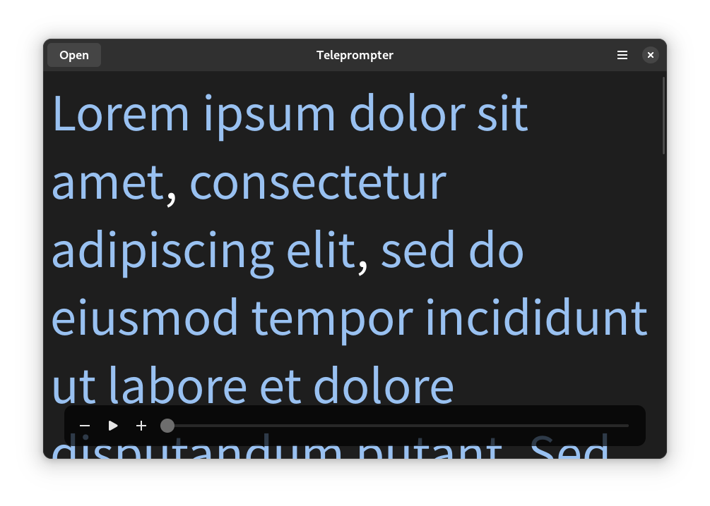

# 


<div align="center">


# Teleprompter

[](https://stopthemingmy.app) 

A simple Gtk4 app to read scrolling text written in python

  <div align="center">
  
  </div>
  
  
</div>

## Installation

### From source

You just need to clone the repository

```sh
git clone https://github.com/Nokse22/teleprompter.git
```

Open the project in GNOME Builder and click "Run Project".
